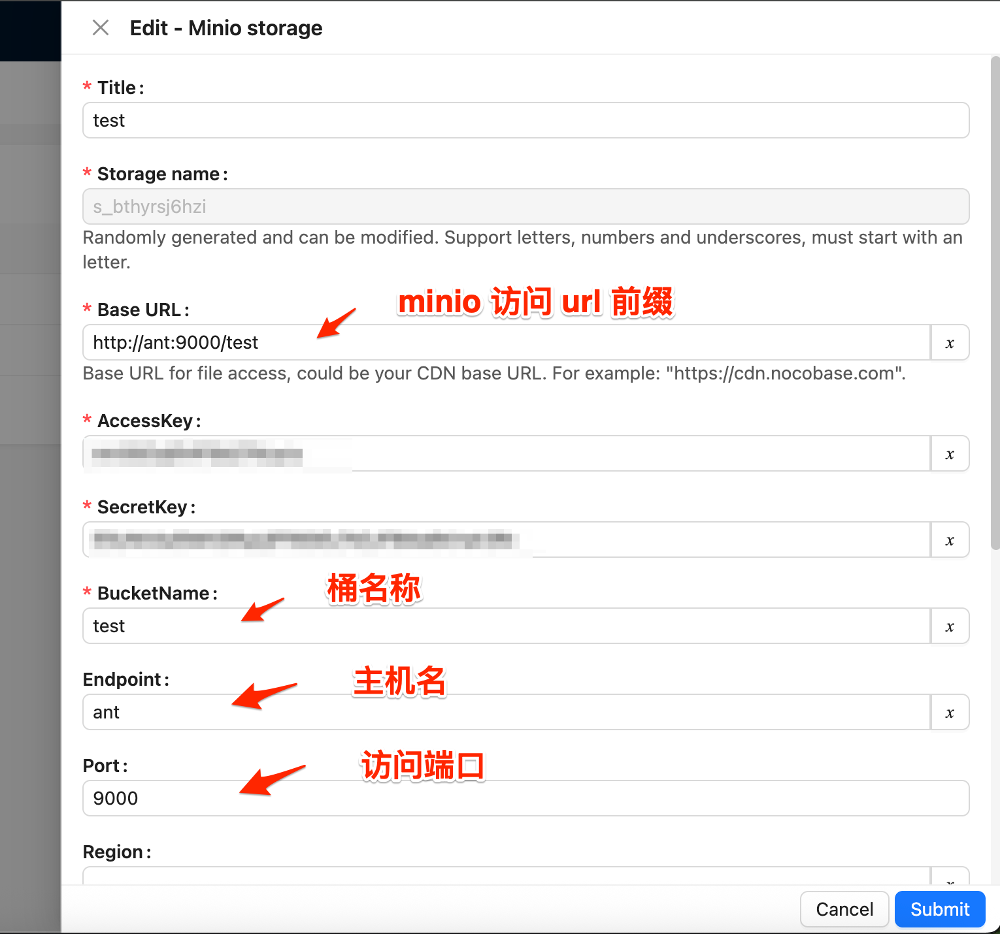

# @marshal/plugin-storage-minio

Nocobase storage plugin for Minio.

## 主要功能

主要功能：

- 基于 s3 协议的存储插件，目前在 Minio 下测试使用，应该兼容其他 s3 协议的存储服务，比如 Amazon S3、华为云 OBS、腾讯云 COS 等
- 实现了预签名url方式的读取，支持私有bucket的用户访问

## 设置

